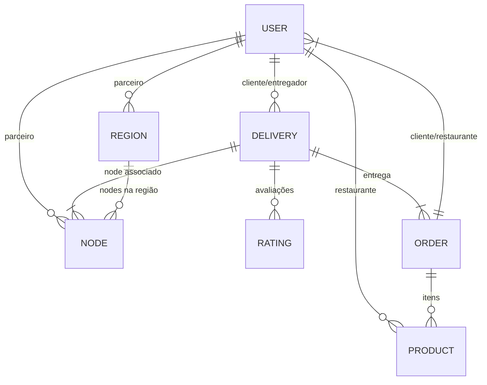

# TODOKE - Plataforma de Delivery Colaborativo

## Visão Geral
O TODOKE é uma plataforma inovadora de gerenciamento de entregas projetada para entregadores e operações com drones. Nosso sistema combina tecnologia de ponta com uma abordagem centrada no usuário, integrando entregadores tradicionais com tecnologia de drones para criar um ecossistema flexível e eficiente.

**Modelo de Negócio:** Tarifa mensal fixa acessível, sem taxas ocultas ou comissões percentuais.

## Principais Recursos
- **Integração pioneira com drones** para áreas de difícil acesso
- **Algoritmos de otimização de rotas** que reduzem tempo e consumo
- **Sistema de reputação transparente** baseado em múltiplos fatores
- **Funcionalidades offline** para áreas com conectividade limitada
- **Precificação comunitária** com participação democrática dos entregadores
- **Ecossistema completo:** API + App + Painel Administrativo

## Arquitetura do Sistema

### Modelos de Dados Principais


### Principais Entidades
- **User**: Todos os tipos de usuários (entregadores, clientes, administradores)
- **Delivery**: Solicitações de entrega com status, origem/destino, etc.
- **Node**: Recursos de entrega (entregadores, drones, veículos)
- **Region**: Áreas geográficas de operação
- **Product**: Itens do cardápio de restaurantes
- **Order**: Pedidos de produtos com status

## API REST
Todas as rotas requerem autenticação via Bearer Token (exceto registro/login).

### Endpoints Principais
- **Autenticação**: `/api/v1/auth/register`, `/api/v1/auth/login`
- **Entregas**: 
  - `POST /api/v1/deliveries` - Criar entrega
  - `PATCH /api/v1/deliveries/{id}/accept` - Aceitar entrega
- **Nodes/Regiões**: 
  - `GET /api/v1/nodes` - Listar nodes
  - `POST /api/v1/regions` - Criar região
- **Pedidos**: 
  - `POST /api/v1/orders` - Criar pedido
  - `PATCH /api/v1/orders/{id}/status` - Atualizar status

**Exemplo Completo** de criação e acompanhamento de entrega disponível na documentação.

## Precificação Comunitária
Sistema democrático onde entregadores colaboram na definição de preços:

1. **Votação por Faixa de Preço**: Mensal, com rankeamento de opções
2. **Fórum Comunitário**: Espaço para troca de informações via áudio
3. **Preço por Custo Real**: Baseado em dados reportados pelos entregadores
4. **Dashboard Coletivo**: Visualização transparente de custos e demanda

## Testes
A suíte de testes inclui:
- Testes unitários para modelos
- Testes de feature para endpoints da API
- Testes de integração para fluxos complexos

**Execução:**
```bash
./vendor/bin/phpunit  # Todos os testes
./vendor/bin/phpunit --testsuite=Unit  # Apenas unitários
```

## Como Contribuir
1. O projeto é open-source sob licença MIT
2. Documentação abrangente disponível
3. Roadmap público para acompanhamento
4. Bug bounty program para vulnerabilidades

## Impacto Social
- Melhora condições de trabalho dos entregadores
- Reduz pegada de carbono das operações
- Democratiza acesso a serviços de entrega
- Fomenta empreendedorismo local


Ideia de propaganda: aquele audio 'pronto querem me comer, aquii nãão'
