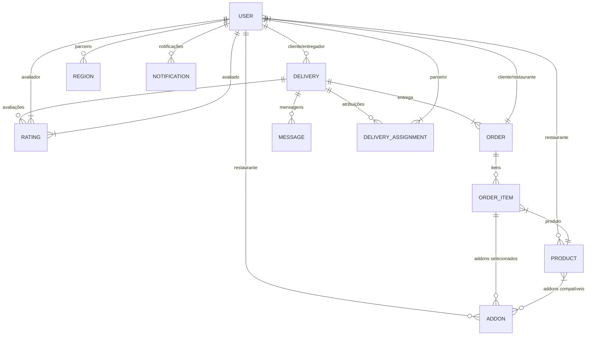

# TODOKE: Modelos de Dados

**Nota sobre convenções:** Todos os nomes de campos e relacionamentos usam convenções em inglês para manter consistência com as melhores práticas de desenvolvimento.

## Visão Geral

Este documento descreve os principais modelos de dados da plataforma TODOKE de forma concisa. Para detalhes completos, consulte os modelos no código fonte.

## Diagrama de Relacionamentos

## Modelos Principais

### 1. Usuário (User)
**Atributos:** id , name, email, phone, type (enum), status  
**Relacionamentos:** Deliveries, Regions, Products, Addons, Notifications

### 2. Entrega (Delivery)  
**Atributos:** 
- id 
- customerId (User)
- courierId (User, nullable)
- logisticsPartnerId (User, nullable, "Parceiro logístico responsável")
- current_position (GeoJSON, nullable)
- status_history (JSON, nullable)
- origin (GeoJSON)
- destination (GeoJSON)  
- status (enum: pending, accepted, in_transit, delivered, canceled)
- type (enum: standard, express, sustainable, priority)
- item_description (string)
- estimated_weight (decimal, nullable)
- dimensions (JSON, nullable)
- value (decimal)
- estimated_time (integer, nullable)
- confirmation_code (string, nullable)
- stages (JSON, nullable)
- createdAt, updatedAt, deletedAt (timestamps)

**Relacionamentos:** 
- User (cliente)
- User (entregador)
- User (parceiro logístico)
- Ratings
- Order 
- Messages 
- Assignments

**Índices:**
- customerId + status
- courierId + status 
- logisticsPartnerId

### 3. Região (Region)  
**Atributos:** 
- id 
- partnerId (User)
- name (string)
- polygon (GeoJSON)
- status (enum: active, inactive)
- createdAt, updatedAt, deletedAt (timestamps)

**Relacionamentos:** 
- User (partner)
**Índices:**
- partnerId

### 4. Avaliação (Rating)  
**Atributos:** 
- id 
- deliveryId (Delivery)
- raterId (User, "usuário que está avaliando")
- ratedId (User, "usuário sendo avaliado") 
- rating (tinyInt unsigned, 1-5)
- comment (text, nullable)
- createdAt, updatedAt (timestamps)

**Relacionamentos:** 
- Delivery
- User (avaliador)
- User (avaliado)

**Índices:**
- deliveryId
- raterId + ratedId (composto)

### 5. Produto (Product)  
**Atributos:** 
- id
- partnerId (User)
- name (string)
- description (text, nullable)
- price (decimal)
- category (string)
- imageUrl (string, nullable)
- status (enum: available, unavailable)
- createdAt, updatedAt, deletedAt (timestamps)

**Relacionamentos:** 
- User (parceiro)
- OrderItems
- Addons (many-to-many)

**Índices:**
- partnerId + status
- category

### 6. Addon (Complemento)
**Atributos:**
- id
- partnerId (User)
- name (string)
- description (text, nullable)
- price (decimal)
- status (enum: available, unavailable)
- createdAt, updatedAt, deletedAt (timestamps)

**Relacionamentos:**
- User (parceiro)
- Products (many-to-many)

**Índices:**
- partnerId + status

### 7. Pedido (Order)  
**Atributos:** 
- id
- customerId (User)
- partnerId (User)
- status (enum: pending, accepted, preparing, awaiting_delivery, delivery_picked_up, delivered, canceled)
- total_value (decimal)
- deliveryId (Delivery, nullable)
- createdAt, updatedAt, deletedAt (timestamps)

**Relacionamentos:** 
- User (cliente)
- User (parceiro)
- Delivery
- OrderItems

**Índices:**
- partnerId + status
- customerId + createdAt

### 8. Item do Pedido (OrderItem)  
**Atributos:** 
- orderId (Order)
- productId (Product)
- quantity (integer)
- unit_price (decimal)
- selected_addons (JSON, nullable)
- createdAt, updatedAt (timestamps)

**Relacionamentos:** 
- Order
- Product

**Índices:**
- productId

### 9. Notificação (Notification)  
**Atributos:** 
- id 
- userId (User)
- type (string)
- data (JSON) 
- read_at (timestamp, nullable)
- createdAt, updatedAt (timestamps)

**Relacionamentos:** 
- User

**Índices:**
- userId + read_at

### 10. Mensagem (Message)  
**Atributos:** 
- id 
- deliveryId (Delivery)
- userId (User)
- text (texto)
- createdAt, updatedAt (timestamps)

**Relacionamentos:** 
- Delivery
- User

**Índices:**
- deliveryId
- userId

### 11. Atribuição de Entrega (DeliveryAssignment)  
**Atributos:**
- id
- deliveryId (Delivery)
- partnerId (User, "parceiro responsável")
- stage (integer, "estágio atual da atribuição")
- status (string, "status atual da atribuição")
- createdAt, updatedAt (timestamps)

**Relacionamentos:**
- Delivery
- User (parceiro)

**Índices:**
- deliveryId + stage
- partnerId + status
