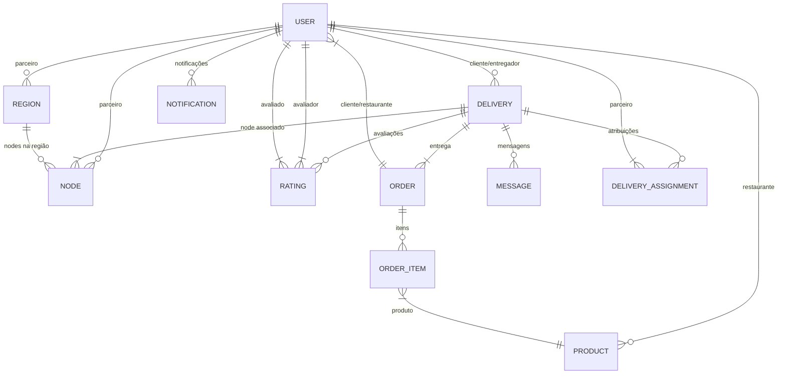

# TODOKE: Modelos de Dados

**Nota sobre convenções:** Todos os nomes de campos e relacionamentos usam convenções em inglês para manter consistência com as melhores práticas de desenvolvimento.

## Visão Geral

Este documento descreve os principais modelos de dados da plataforma TODOKE de forma concisa. Para detalhes completos, consulte os modelos no código fonte.

## Diagrama de Relacionamentos

## Modelos Principais

### 1. Usuário (User)
**Atributos:** id , name, email, phone, type (enum), status  
**Relacionamentos:** Deliveries, Nodes, Regions, Products, Notifications

### 2. Entrega (Delivery)  
**Atributos:** 
- id 
- customerId (User)
- courierId (User, nullable)
- logisticsPartnerId (User, nullable, "Parceiro logístico responsável")
- current_position (GeoJSON, nullable)
- status_history (JSON, nullable)
- origin (GeoJSON)
- destination (GeoJSON)  
- status (enum: pending, accepted, in_transit, delivered, canceled)
- type (enum: standard, express, sustainable, priority)
- item_description (string)
- estimated_weight (decimal, nullable)
- dimensions (JSON, nullable)
- value (decimal)
- estimated_time (integer, nullable)
- confirmation_code (string, nullable)
- stages (JSON, nullable)
- nodeId (Node, nullable)
- createdAt, updatedAt, deletedAt (timestamps)

**Relacionamentos:** 
- User (cliente)
- User (entregador)
- User (parceiro logístico)
- Ratings
- Node 
- Order 
- Messages 
- Assignments

**Índices:**
- customerId + status
- courierId + status 
- logisticsPartnerId
- nodeId

### 3. Node (Node)  
**Atributos:** 
- id 
- partnerId (User)
- type (enum: partner, distribution_center, delivery_point)
- identifier (string, unique)
- capacity (decimal, nullable)
- status (enum: active, inactive, maintenance, pending_approval)
- regionId (Region)
- current_position (GeoJSON)
- createdAt, updatedAt, deletedAt (timestamps)

**Relacionamentos:** 
- User (parceiro)
- Region 
- Deliveries

**Índices:**
- regionId + type
- partnerId

### 4. Região (Region)  
**Atributos:** 
- id 
- partnerId (User)
- name (string)
- polygon (GeoJSON)
- status (enum: active, inactive)
- createdAt, updatedAt, deletedAt (timestamps)

**Relacionamentos:** 
- User (partner)
- Nodes

**Índices:**
- partnerId

### 5. Avaliação (Rating)  
**Atributos:** 
- id 
- deliveryId (Delivery)
- raterId (User, "usuário que está avaliando")
- ratedId (User, "usuário sendo avaliado") 
- rating (tinyInt unsigned, 1-5)
- comment (text, nullable)
- createdAt, updatedAt (timestamps)

**Relacionamentos:** 
- Delivery
- User (avaliador)
- User (avaliado)

**Índices:**
- deliveryId
- raterId + ratedId (composto)

### 6. Produto (Product)  
**Atributos:** id, partnerId, name, price, status (enum)  
**Relacionamentos:** User (parceiro), OrderItems

### 7. Pedido (Order)  
**Atributos:** id, customerId, partnerId, status (enum), totalValue  
**Relacionamentos:** User (cliente/parceiro), Delivery, OrderItems

### 8. Item do Pedido (OrderItem)  
**Atributos:** orderId, productId, quantity, unitPrice  
**Relacionamentos:** Order, Product

### 9. Notificação (Notification)  
**Atributos:** 
- id 
- userId (User)
- type (string)
- data (JSON) 
- read_at (timestamp, nullable)
- createdAt, updatedAt (timestamps)

**Relacionamentos:** 
- User

**Índices:**
- userId + read_at

### 10. Mensagem (Message)  
**Atributos:** 
- id 
- deliveryId (Delivery)
- userId (User)
- text (texto)
- createdAt, updatedAt (timestamps)

**Relacionamentos:** 
- Delivery
- User

**Índices:**
- deliveryId
- userId

### 11. Atribuição de Entrega (DeliveryAssignment)  
**Atributos:**
- id
- deliveryId (Delivery)
- partnerId (User, "parceiro responsável")
- stage (integer, "estágio atual da atribuição")
- status (string, "status atual da atribuição")
- createdAt, updatedAt (timestamps)

**Relacionamentos:**
- Delivery
- User (parceiro)

**Índices:**
- deliveryId + stage
- partnerId + status
