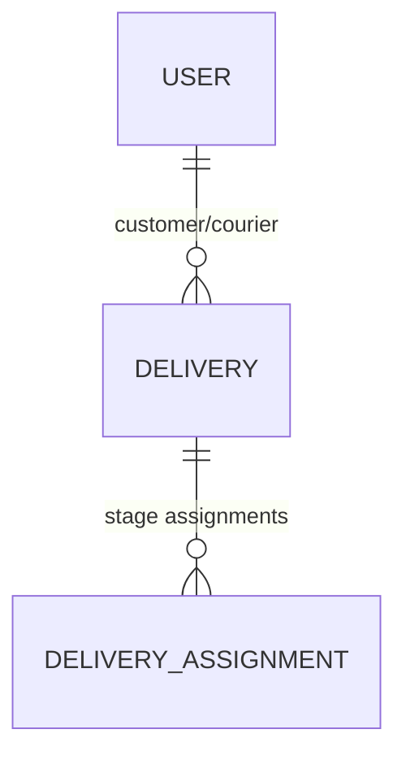

# TODOKE Project Brief

## Overview
TODOKE is an innovative delivery management platform combining traditional couriers with drone technology. It features a democratic pricing model where couriers collaboratively determine delivery prices.

## Core Features
1. **Internationalization**:
   - Multi-language support with pt-BR as first translation
   - Extensible architecture for adding new languages
   - Language selection in user profile
   - All UI text stored in translation files

2. **Hybrid Delivery System**:
   - Integration of motorbike couriers and drones
   - Specialized status tracking for drone operations
   - Automatic stage assignments for multi-part deliveries

2. **Community Pricing**:
   - Monthly price band voting system
   - Community audio forum for information sharing
   - Transparent cost-based pricing dashboard

3. **Technical Capabilities**:
   - Offline functionality for low-connectivity areas
   - Optimized routing algorithms
   - Comprehensive reputation system including:
     - Customer reputation tracking for partner/courier safety
     - Rating and feedback mechanisms
     - Fraud detection capabilities

## Business Model
- Fixed monthly subscription fee
- No hidden charges or percentage commissions
- Open-source under MIT license

## Key Entities

## API Architecture
- RESTful design with Bearer Token authentication
- Core endpoints for deliveries, regions and orders
- Specialized endpoints for hybrid delivery status updates

## Testing Approach
- Comprehensive feature tests covering:
  - Authentication
  - Delivery flows (including hybrid)
  - Partner operations
  - Security
- Unit tests focusing on models and core business logic
- TDD methodology for new features
