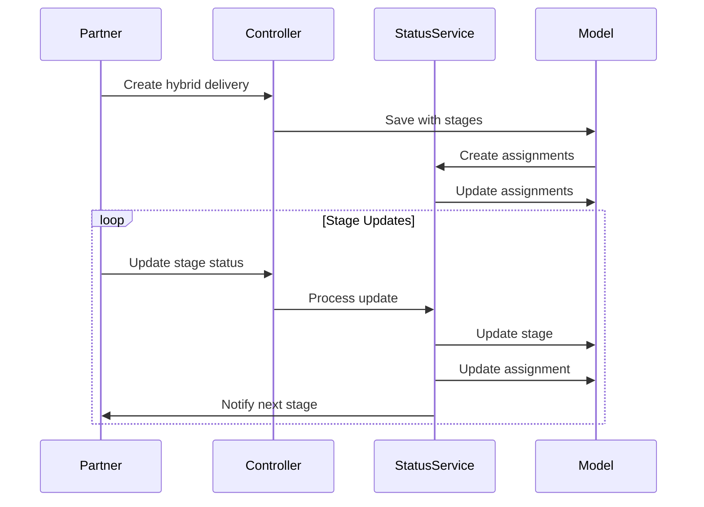

# TODOKE System Patterns

## Core Architecture

### Hybrid Delivery System


### Key Design Patterns

1. **State Pattern**:
   - Used in DeliveryStatusService for handling different delivery states
   - Specialized status handling for drone operations

2. **Observer Pattern**:
   - Status changes trigger notifications
   - Stage completions notify next partners

3. **Strategy Pattern**:
   - Different pricing calculation methods, including region-specific variations based on factors like gas prices and demand.
   - Various routing algorithms

## Data Structures

### Delivery Stages
```php
[
    [
        'type' => 'delivery_point',
        'status' => 'pending',
        'partner_id' => 123,
        'node_id' => 456
    ],
    [
        'type' => 'distribution_center', 
        'status' => 'pending',
        'partner_id' => 789,
        'node_id' => 101
    ]
]
```

### Delivery Assignments
```php
[
    'delivery_id' => 1,
    'partner_id' => 123,
    'stage' => 1,
    'status' => 'pending'
]
```

## API Design

### Key Endpoints
- `POST /api/v1/deliveries`: Create delivery (handles hybrid flag)
- `PATCH /api/v1/deliveries/{id}/status`: Update status (stage-aware)
- `GET /api/v1/deliveries/{id}/stages`: Get stage information

### Status Flow
```mermaid
stateDiagram-v2
    [*] --> pending
    pending --> accepted
    accepted --> collected
    collected --> in_transit
    in_transit --> delivered
    in_transit --> canceled
    
    state drone_stage {
        collected --> drone_launched
        drone_launched --> drone_in_route
        drone_in_route --> drone_arrived
        drone_arrived --> delivered
    }
