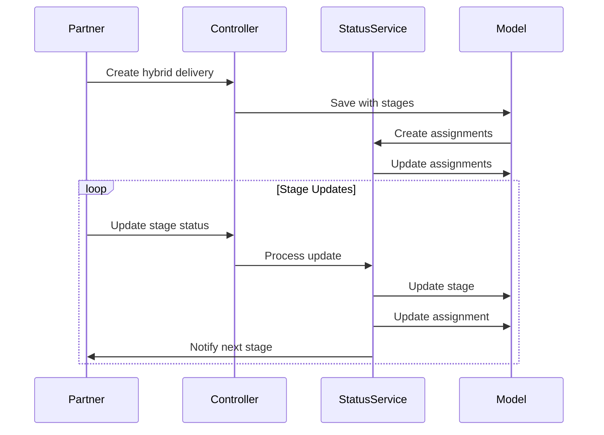
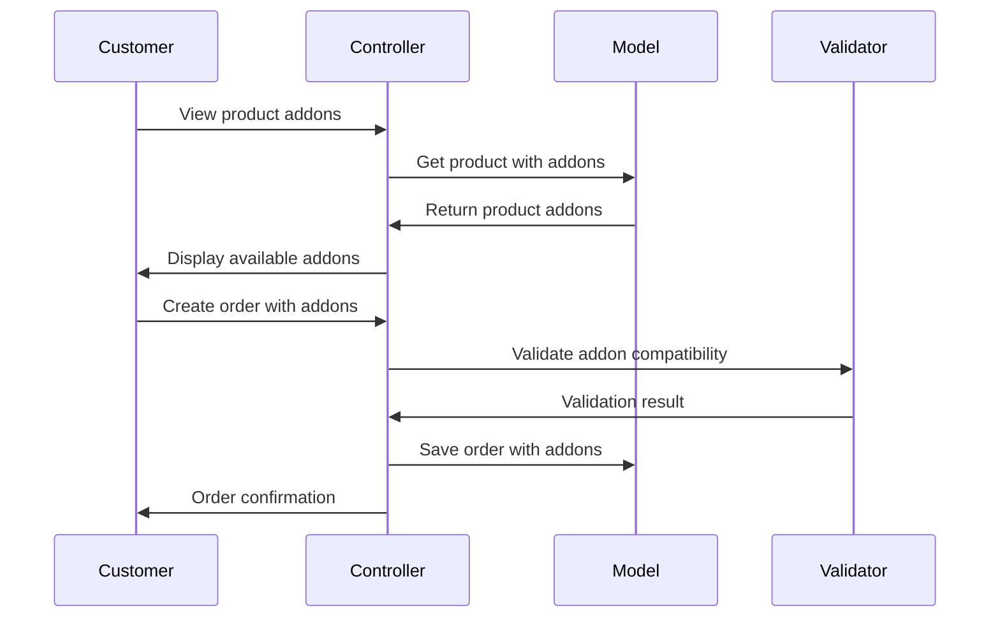
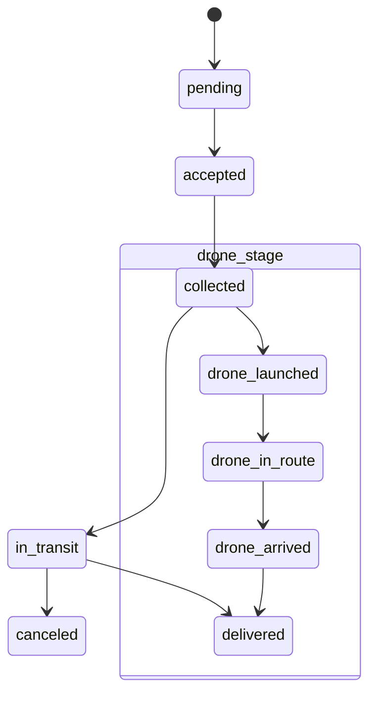

# TODOKE System Patterns

## Core Architecture

### Hybrid Delivery System


### Product Customization System


### Key Design Patterns

1. **State Pattern**:
   - Used in DeliveryStatusService for handling different delivery states
   - Specialized status handling for drone operations

2. **Observer Pattern**:
   - Status changes trigger notifications
   - Stage completions notify next partners

3. **Strategy Pattern**:
   - Different pricing calculation methods, including region-specific variations based on factors like gas prices and demand.
   - Various routing algorithms

4. **Decorator Pattern**:
   - Product addons act as decorators for base products
   - Each addon adds functionality (and cost) to the base product

5. **Repository Pattern**:
   - Controllers interact with models through repository interfaces
   - Enables clean separation of concerns and testability

## Data Structures

### Delivery Stages
```php
[
    [
        'type' => 'delivery_point',
        'status' => 'pending',
        'partner_id' => 123,
        'node_id' => 456
    ],
    [
        'type' => 'distribution_center', 
        'status' => 'pending',
        'partner_id' => 789,
        'node_id' => 101
    ]
]
```

### Delivery Assignments
```php
[
    'delivery_id' => 1,
    'partner_id' => 123,
    'stage' => 1,
    'status' => 'pending'
]
```

### Selected Addons
```php
[
    [
        'id' => 1,
        'name' => 'Extra Cheese',
        'quantity' => 2,
        'unit_price' => 2.50
    ],
    [
        'id' => 3,
        'name' => 'Bacon Bits',
        'quantity' => 1,
        'unit_price' => 3.00
    ]
]
```

## API Design

### Key Endpoints

#### Delivery Endpoints
- `POST /api/v1/deliveries`: Create delivery (handles hybrid flag)
- `PATCH /api/v1/deliveries/{id}/status`: Update status (stage-aware)
- `GET /api/v1/deliveries/{id}/stages`: Get stage information

#### Product and Addon Endpoints
- `GET /api/v1/products`: List available products
- `GET /api/v1/products/{product}/addons`: Get addons for a product
- `POST /api/v1/addons`: Create a new addon
- `POST /api/v1/products/{product}/addons`: Associate addons with a product
- `POST /api/v1/orders`: Create an order with optional addons

### Status Flow


### Entity Relationships
```mermaid
erDiagram
    USER ||--o{ PRODUCT : "partner creates"
    USER ||--o{ ORDER : "customer places"
    PRODUCT ||--o{ ORDER_ITEM : "included in"
    PRODUCT }|--o{ ADDON : "compatible with"
    ORDER ||--|{ ORDER_ITEM : "contains"
    ORDER_ITEM ||--o{ ADDON : "selected"
    USER ||--o{ ADDON : "partner creates"
